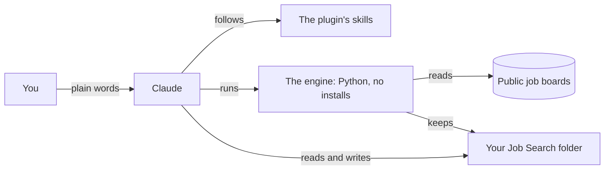

# job-search-kit

**Your job search, run by Claude, from a folder on your own computer.**

A free, open-source plugin for [Claude Cowork](https://claude.com/download). It checks hundreds of company job boards (every morning, if you like), screens each posting against rules built from your own background and wishes, keeps track of everything you apply to, and helps with your resume and interviews when you ask. You never open a terminal or edit a file: you talk to Claude in plain words.

[](https://github.com/acrosbie/job-search-kit/actions/workflows/tests.yml)

[](LICENSE)

> **Beta.** It runs a real job search every day, but nobody outside the project has installed it yet. Expect rough edges, and please [tell us](https://github.com/acrosbie/job-search-kit/issues) what you hit.

## What it's like

```
You:    any new jobs?
Claude: 11 new since yesterday. 7 were screened out on your own rules
        (5 outside where you'd commute, 2 below your pay line).
        Want me to go through the other 4?

You:    go through them
Claude: #41 Northwind Logistics, Accounting Manager: worth applying.
          For your resume: lead with cutting the close from 10 days to 6;
          mirror their words "month-end close" and "NetSuite".
        #42 Globex Health, Assistant Controller: your call. It asks for
          "consolidation of multiple entities". You weren't sure you have
          that. Only you can say.
        #43 Initech, Senior Accountant: not a fit. Your rule "owns something":
          "you will prepare journal entries under the controller's direction".
        #44 Acme Retail, Controller: not a fit. Your rule on level: "5+ years
          managing managers is required".
```

The examples here are all one made-up job seeker, Morgan, an accounting manager in Denver. Every verdict quotes the posting it rests on.

## What it does

| | |
|---|---|
| **Finds jobs** | Reads about 590 public company job boards (Greenhouse, Ashby, Lever, SmartRecruiters, Workday, Rippling), the Himalayas remote-jobs search, and any company you name. A posting you paste from LinkedIn or anywhere else is screened too. |
| **Screens them your way** | Every rule comes from your own answers, says why it turned a job away, and quotes the posting. You can overturn any verdict. |
| **Learns from you** | A weekly review shows where your choices and a rule disagree, spot-checks what was turned away, and proposes a better rule. Nothing changes until you say yes, and only after it's been tried on your saved jobs. |
| **Tracks applications** | Follow-ups when there's a real person to write to, a search for one when it's a top pick, and an application with no reply closes itself after three weeks. |
| **Shows you everything** | A jobs page with what's waiting, what's due and every application, each job with a number that never changes. Click your choices there, or say them in chat. |
| **Helps with your resume** | Only when you ask: checks it against what you've confirmed about yourself, and makes a clean or tailored copy in Word and PDF. |
| **Preps you for interviews** | Records the interview with a calendar file, writes a prep sheet from what's true about you, runs a mock interview, and takes down how it went. |
| **Knows the going rate** | The pay ranges your saved postings actually state, and how many reach your ask. Facts from postings, never a prediction. |

## See it at work

<details>
<summary><b>Setting up: one conversation, one question at a time</b></summary>

```
Claude: Your resume says "Lead a team of 6". How many people reported
        to you directly?
You:    four, the other two were on loan from AP
Claude: Saved as 4 direct reports. I'll never use "a team of 6".

Claude: Here are 10 titles I'd show you, and 10 I left out. Would you
        want to see jobs titled like these?
        Kept: Accounting Manager · Assistant Controller · Senior Manager,
        Accounting · ...
        Left out: Accounting Supervisor · Revenue Accountant · ...
You:    yes to supervisor, no to the rest
Claude: Done. That adds 23 jobs the boards list today.
```
Setup builds your profile from your resume and LinkedIn (asking about anything that doesn't match), what you want (place, pay, hours, deal-breakers, in your words), your screening rules and your job boards, then runs a first scan and checks the titles with you.
</details>

<details>
<summary><b>A job you found on LinkedIn</b></summary>

```
You:    what about this one? linkedin.com/jobs/view/...
Claude: LinkedIn can't be read from here. Paste the posting's text and
        I'll screen it like any other.
You:    [pastes it]
Claude: Saved as #58 Granite Peak, Accounting Manager: your call. It says
        "CPA required". You've passed 3 of 4 sections. Apply and say so,
        or skip?
```
</details>

<details>
<summary><b>Changing a rule, the careful way</b></summary>

```
You:    stop showing me jobs in Boulder, the drive is too long
Claude: I tried it on your 212 saved jobs. It would turn away 6 more,
        including #31 Front Range Analytics, which you marked "want it".
        Turn that one away too, or keep Boulder for remote jobs only?
You:    remote only
Claude: Saved: Boulder only if the job is remote. It would have turned
        away 5 jobs, none you wanted or applied to.
```
Every change is tried on your saved jobs first, saved with your words and the date, and refused if it would quietly turn away something you wanted.
</details>

<details>
<summary><b>What's due</b></summary>

```
You:    what's due?
Claude: Follow up with Dana Example at Northwind (day 8). Want a draft?
        Globex Health is a top pick with nobody to follow up with: look
        for whoever leads accounting there, and tell me their name.
        No reply from Initech in three weeks, so I've moved it to no reply.
```
A follow-up needs someone to receive it, so it's only suggested when there is one. A draft is three or four sentences, from what's true about you, and yours to send.
</details>

<details>
<summary><b>The weekly review</b></summary>

```
Claude: You've overturned the "owns something" rule twice this week, both
        times for Senior Accountant jobs that run the close. Change it to
        let those through? I tried it on your saved jobs: it would bring
        back #43 and #61, and turn nothing else away.
        Spot-check: here are 10 jobs the scan turned away automatically.
        Any you'd have wanted?
```
</details>

<details>
<summary><b>Checking your resume</b></summary>

```
You:    check my resume
Claude: 3 lines go further than what you've confirmed:
        "Senior Accounting Manager": you said your title was Accounting
          Manager.
        "Owned revenue recognition (ASC 606)": you worked alongside the
          revenue accountant on it, and didn't own it.
        "Managed payroll": payroll accounting only, not payroll processing.
        Everything else traces to what you've told me.
```
Ask for a clean resume, or a copy tailored to one job, and you get a Word file and a PDF, made only when every line traces to something you've confirmed.
</details>

<details>
<summary><b>An interview</b></summary>

```
You:    I have a video interview with Northwind on Thursday at 2
Claude: Recorded, with a calendar file you can double-click to add it.
        Want a prep sheet?
You:    yes
Claude: The posting asks for "Adaptive Planning". I don't have anything
        on that from you. Have you used it?
You:    no, only NetSuite's budgeting
Claude: Saved. Your prep sheet is ready: the role in brief, your opener,
        the questions they'll likely ask with answers from what's true,
        the gaps (Adaptive Planning, and how to bridge it from NetSuite),
        pay, and questions to ask.

You:    mock interview
Claude: Tell me about a time you sped up a process.
You:    [answers]
Claude: Good structure. You said "a team of six"; you confirmed 4 direct
        reports. Next question...
```
Afterwards, "how did it go?" records what they asked and what's next, and offers a thank-you note.
</details>

<details>
<summary><b>What the jobs pay</b></summary>

```
You:    what do these jobs actually pay?
Claude: 38 of your saved postings state a range. The middle of their tops
        is $142K, and a quarter top out below $125K. Your ask of $135K is
        reached by 27 of the 38. That's what the postings say, not what
        you'd be offered.
```
</details>

<details>
<summary><b>The jobs page</b></summary>

What's waiting on you, what's due and every application, with the 21-day clock on each. Mark jobs as you read them: your clicks save in your own Claude account, and Claude records them in your folder the next time you talk. A copy, **My jobs.html**, sits in your folder and is always up to date.
</details>

<details>
<summary><b>On a schedule</b></summary>

Ask for a daily check and a weekly review, and Claude sets them up as scheduled tasks. They run while your computer is on and the Claude app is open. A missed one is caught up the next time you talk.
</details>

## What it won't do

- **Apply, email or message anyone for you.** It drafts; you send.
- **Say anything about you that you haven't confirmed.** Resumes, prep sheets and drafts are checked line by line against your own confirmed facts. Inflated or unconfirmed claims are flagged, never smoothed over.
- **Guess your odds.** No predicted response rates, applicant counts or chances of an offer.
- **Send your data anywhere.** Everything about you lives in one folder on your computer. The one exception is your choice: the jobs page can live in your own Claude account, where it keeps a private copy of your jobs list and your clicks until Claude records them in your folder (or keep it as a file in the folder only). Otherwise the kit's only requests are to public job boards. This repository never contains anyone's personal data, and its tests check for that.
- **Read LinkedIn by itself.** You paste the posting; it works from that.
- **Change a rule behind your back.** Every change is tried on your saved jobs and waits for your yes.

## Get started

You need a computer running Windows or macOS (Windows is tested; Mac isn't yet), a paid Claude plan (Pro or Max), and your resume.

1. Install the [Claude desktop app](https://claude.com/download) and sign in.
2. In **Customize**, then **Plugins**, add the marketplace `acrosbie/job-search-kit` and install **job-search**.
3. Make an empty folder called **Job Search**.
4. In Cowork (the speech-bubble icon), connect that folder and say **set me up**.

Setup is one conversation, about an hour, one question at a time; you can stop and pick up later. The full guide is **[docs/install.md](docs/install.md)**.

## Things to say

| Say | What happens |
|---|---|
| "any new jobs?" | Checks your job boards and says what's new |
| "go through the new ones" | Sorts them into worth applying, your call, and not a fit |
| "skip #12, it's too far" | Records your call; the reason can become a rule |
| *paste a job link or a posting* | Screens that job too |
| "I applied to Acme" / "Acme replied" | Keeps your applications up to date |
| "what's due?" | Follow-ups worth sending, and to whom |
| "stop showing me jobs in Boulder" | Changes a rule, after trying it on your saved jobs |
| "go through my review" | The weekly review |
| "check my resume" / "tailor my resume for #41" | Your resume against what you've confirmed |
| "I have an interview with Acme on Thursday at 2" | Records it, with a calendar file and a prep offer |
| "prep me for it" / "mock interview" / "how did it go?" | Before, during practice, and after |
| "show me my jobs page" | Opens your jobs page |
| "check my job boards every morning" | Sets up the daily check |

## How it works



- **The engine** (`plugins/job-search/engine`) does the mechanical work: fetching boards, the filters and automatic rejects, the records, the jobs page. Python standard library only, Python 3.10 or later, and it never deletes a file.
- **The skills** (`plugins/job-search/skills`) are what Claude follows for anything that needs judgment or a conversation: setup, screening, tracking, the weekly review, rule changes, resumes and interviews.
- **Your folder** holds everything about you: your profile, your rules, every job found, every decision and application. It's yours; the kit only ever adds to it.

Where the engine can check something itself rather than trust the instructions, it does, because instructions get skipped: a quoted line really is in the posting; a rule change was tried on your saved jobs; a resume line traces to something you confirmed; a debrief is written down before it counts.

## Today's limits

- Tested on Windows only. Macs and Team or Enterprise accounts are untested.
- One finished field pack: customer support and CX, tuned on a real search. Other fields, like Morgan's accounting, get their job titles from setup, which works but is less tuned.
- Places are US only.
- Claude needs network access to reach job boards (Settings, Capabilities). On some plans that means allowing all sites.
- Scheduled checks run while your computer is on and the Claude app is open.
- The jobs page saves your clicks by itself as a page in your Claude account. If you'd rather keep it only as a file in your folder, you copy your choices into Claude (saving straight into the folder from Chrome or Edge is next).

## For contributors

```
python -m unittest discover -s tests -t .
```

The tests (256 today) run on Python 3.10 and 3.12, on Ubuntu and Windows, on every push. They replay recorded answers from real public job boards, so they need no network. More in **[docs/](docs/README.md)**.

- `plugins/job-search/engine/README.md`: every engine command and file format.
- `docs/decisions/`: why it's built on Cowork the way it is.
- `docs/phase-*/`: the build log, with how each phase was tested and what it showed.
- Test personas are made up (`tests/personas`). Never add anyone's real data: `tests/test_guards.py` checks.

## Licence

[MIT](LICENSE).
