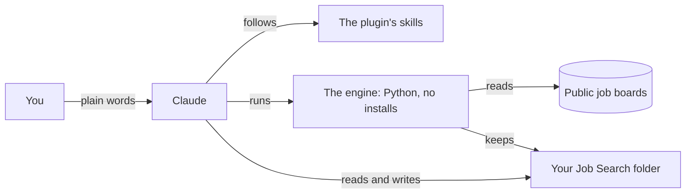

# job-search-kit

**Your job search, run by Claude, from a folder on your own computer.**

A free, open-source plugin for [Claude Cowork](https://claude.com/download). It checks hundreds of company job boards (every morning, if you like), screens each posting against rules built from your own background and wishes, and keeps track of everything you apply to. You never open a terminal or edit a file: you talk to Claude in plain words.

[](https://github.com/acrosbie/job-search-kit/actions/workflows/tests.yml)

[](LICENSE)

> **Beta.** It runs a real job search every day, but nobody outside the project has installed it yet. Expect rough edges, and please [tell us](https://github.com/acrosbie/job-search-kit/issues) what you hit.

## What it's like

```
You:    any new jobs?
Claude: 14 new since yesterday. 9 were screened out on your own rules
        (6 outside where you'd commute, 2 below your pay line, 1 quota-carrying).
        Want me to go through the other 5?

You:    go through them
Claude: #41 Northwind, Support Operations Manager: worth applying.
          For your resume: lead with the help-desk migration you ran;
          mirror their words "self-service" and "knowledge base".
        #42 Globex, Head of Customer Care: your call. It says "regular
          weekend coverage". Is that a deal-breaker? Only you can say.
        #43 Initech, CX Analyst: not a fit. Your rule "owns something":
          "you will work the support queue daily".

You:    I applied to 41 through their site, it's a top pick
Claude: Recorded: #41 Northwind, today, on their site, a top pick.
```

*(A made-up job seeker; every verdict quotes the posting it rests on.)*

## What it does

- **Finds jobs.** Reads about 590 public company job boards (Greenhouse, Ashby, Lever, SmartRecruiters, Workday, Rippling) plus the Himalayas remote-jobs search, and any company you name. A link you paste from LinkedIn or anywhere else is screened too.
- **Screens them your way.** Every rule comes from your answers during setup, says why it rejected a job in plain words, and quotes the posting. You can overturn any verdict, and the weekly review notices when your choices and a rule disagree.
- **Tracks applications.** Follow-ups when there's a real person to write to, an application with no reply closes itself after three weeks, and a jobs page shows what's waiting, what's due and every application.
- **Helps when you ask.** Checks your resume against what you've confirmed about yourself, makes a clean or tailored copy in Word and PDF, preps you for an interview with a calendar file, a prep sheet and a mock run, and records how it went.

## What it won't do

- **Apply, email or message anyone for you.** It drafts; you send.
- **Say anything about you that you haven't confirmed.** Resumes, prep sheets and drafts are checked line by line against your own confirmed facts. Inflated or unconfirmed claims are flagged, never smoothed over.
- **Guess your odds.** No predicted response rates, applicant counts or chances of an offer.
- **Send your data anywhere.** Everything about you lives in one folder on your computer. The kit's only requests are to public job boards. This repository never contains anyone's personal data, and its tests check for that.
- **Read LinkedIn by itself.** You paste the posting; it works from that.

## Get started

You need a computer running Windows or macOS (Windows is tested; Mac isn't yet), a paid Claude plan (Pro or Max), and your resume.

1. Install the [Claude desktop app](https://claude.com/download) and sign in.
2. In **Customize**, then **Plugins**, add the marketplace `acrosbie/job-search-kit` and install **job-search**.
3. Make an empty folder called **Job Search**.
4. In Cowork (the speech-bubble icon), connect that folder and say **set me up**.

Setup is one conversation, about an hour, one question at a time; you can stop and pick up later. The full guide, with what each screen looks like, is **[docs/install.md](docs/install.md)**.

## Things to say

| Say | What happens |
|---|---|
| "any new jobs?" | Checks your job boards and says what's new |
| "go through the new ones" | Sorts them into worth applying, your call, and not a fit |
| "skip #12, it's too far" | Records your call; the reason can become a rule |
| *paste a job link* | Screens that job too |
| "I applied to Acme" / "Acme replied" | Keeps your applications up to date |
| "what's due?" | Follow-ups worth sending, and to whom |
| "go through my review" | The weekly review: rules you've overturned, a spot-check, your follow-ups |
| "check my resume" | Your resume against what you've confirmed |
| "I have an interview with Acme on Thursday at 2" | Records it, with a calendar file and a prep offer |
| "show me my jobs page" | Opens your jobs page |

## How it works



- **The engine** (`plugins/job-search/engine`) does the mechanical work: fetching boards, the filters and automatic rejects, the records, the jobs page. Python standard library only, Python 3.10 or later, and it never deletes a file.
- **The skills** (`plugins/job-search/skills`) are what Claude follows for anything that needs judgment or a conversation: setup, screening, tracking, the weekly review, resumes and interviews.
- **Your folder** holds everything about you: your profile, your rules, every job found, every decision and application. It's yours; the kit only ever adds to it.

Where the engine checks something itself rather than trusting the instructions (a quoted line really is in the posting; a rule change was tried on your saved jobs before it's saved; a resume line traces to something you confirmed), it does, because instructions get skipped.

## Today's limits

- Tested on Windows only. Macs and Team or Enterprise accounts are untested.
- One finished field pack (customer support and CX). Other fields get their job titles from setup, which works but is less tuned.
- Places are US only.
- Claude needs network access to reach job boards (Settings, Capabilities). On some plans that means allowing all sites.
- Scheduled checks run while your computer is on and the Claude app is open.
- The jobs page saves your clicks by itself when it's a page in your Claude account. As a file in your folder, you copy your choices into Claude (saving straight into the folder from Chrome or Edge is next).

## For contributors

```
python -m unittest discover -s tests -t .
```

The tests (256 today) run on Python 3.10 and 3.12, on Ubuntu and Windows, on every push. They replay recorded answers from real public job boards, so they need no network.

- `plugins/job-search/engine/README.md`: every engine command and file format.
- `docs/decisions/`: why it's built on Cowork the way it is.
- `docs/phase-*/`: the build log, with how each phase was tested and what it showed.
- Test personas are made up (`tests/personas`). Never add anyone's real data: `tests/test_guards.py` checks.

## Licence

[MIT](LICENSE).
